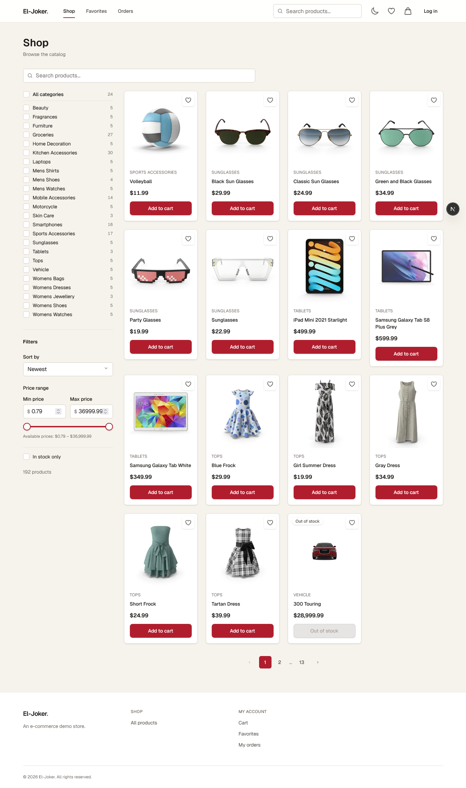
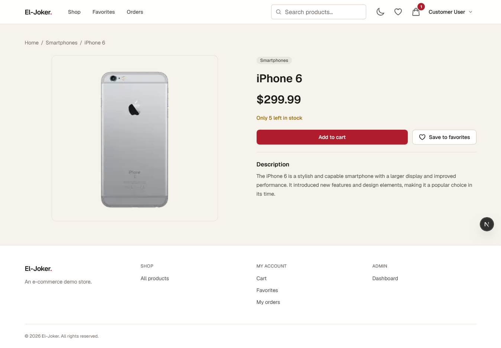
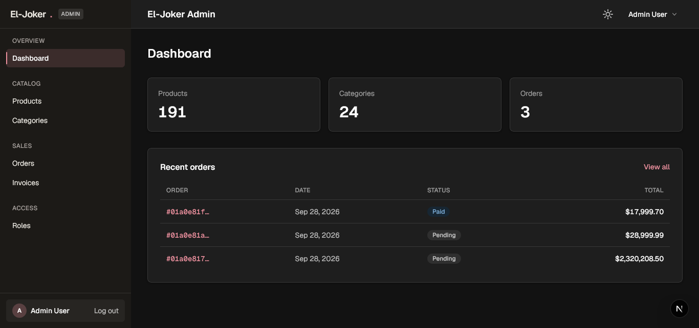
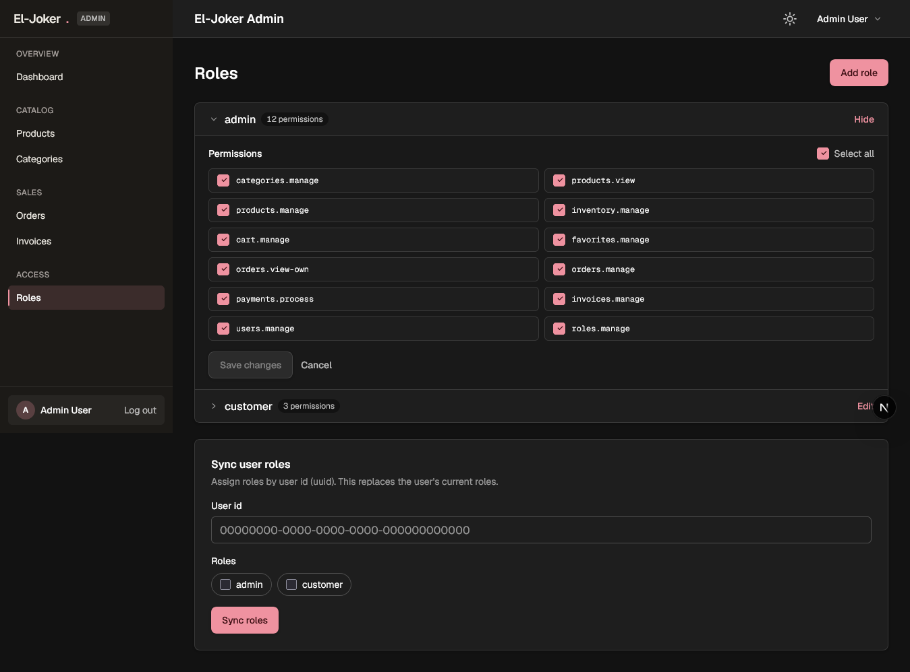
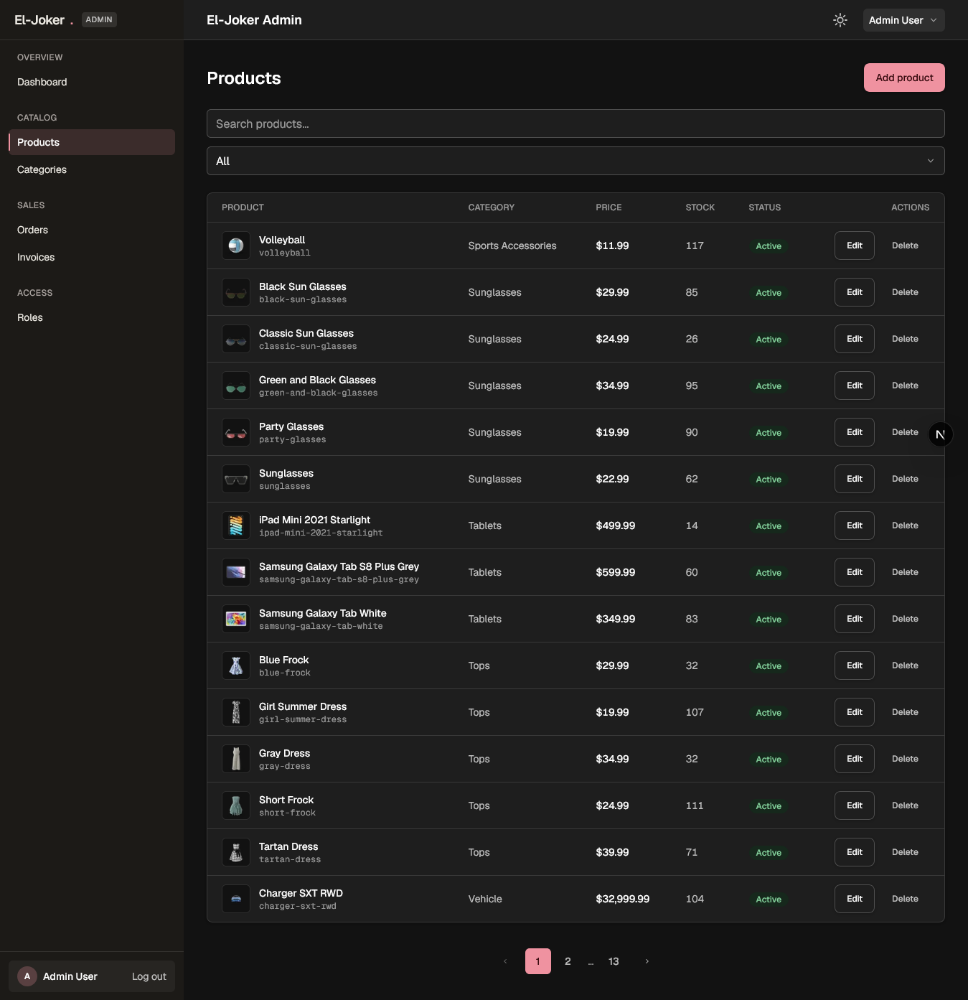

<div align="center">

# El-Joker

**A full-stack e-commerce platform with a customer storefront, an admin panel, role-based access control, and a native mobile client.**

Laravel 13 REST API · Next.js 16 web app · Expo SDK 57 mobile app · PostgreSQL

<br/>

[](https://laravel.com)
[](https://nextjs.org)
[](https://react.dev)
[](https://expo.dev)
[](https://www.typescriptlang.org)
[](https://www.php.net)
[](https://www.postgresql.org)
[](https://tailwindcss.com)

</div>

---

## ✨ Features

| 👤 Customer Storefront                                   | ⚙️ Admin Panel                                  |
| -------------------------------------------------------- | ------------------------------------------------ |
| Product catalog with **search, category, price & stock filters** and sorting | Dashboard overview                     |
| Product detail pages with inventory-aware stock states   | Product / category **CRUD** with stock management |
| Account registration, login & profile                    | Order management (status lifecycle)               |
| Cart with quantity controls & validation                 | Invoice browsing, search & PDF regeneration       |
| Favorites / wishlist                                     | Role & **permission (RBAC) management**           |
| Checkout & order history                                 | Dedicated admin token auth (`/admin/login`)       |
| **PDF invoice download** per order                        |                                                   |

**Platform-wide**

- 🔐 Token authentication via **Laravel Sanctum** with cookie-synced sessions.
- 🎭 **Role-Based Access Control** — granular permissions enforced on every route.
- 🧾 **Queued PDF invoice generation** (dompdf) fired after checkout commits.
- 📝 Order lifecycle: `pending → paid → shipped → delivered → cancelled`.
- 🔎 PostgreSQL **pg_trgm full-text search** with GIN indexes on product title & description.
- 🌗 Dark / light theme with system-preference detection.
- 🧵 Modern frontend stack: TanStack Query, Zustand, react-hook-form + Zod, Tailwind CSS v4.

---

## 🏗️ Architecture

```
┌────────────────────────────────┐        ┌────────────────────────────────┐
│        WEB  ·  Next.js 16      │        │     MOBILE · Expo SDK 57       │
│     storefront + admin         │        │  storefront + staff console    │
│                                │        │                                │
│  proxy.ts ──▶ route guard      │        │  Stack.Protected ─▶ guard      │
│   (cookie → GET auth/me)       │        │   (2 scopes: api | admin)      │
│                                │        │                                │
│  Zustand ─▶ auth session       │        │  SecureStore ─▶ 2 scopes       │
│  TanStack Query ─▶ all else    │        │  TanStack Query ─▶ all else    │
│  (cart, catalog, orders)       │        │  (cart, catalog, orders)       │
└───────────────┬────────────────┘        └───────────────┬────────────────┘
                │  HTTPS · JSON · Bearer <sanctum token>  │
                └──────────────────────────────────────┬──┘
                                                       │
                                 ┌──────────────────────────────────────────┐
                                 │        LARAVEL 13 · JSON API             │
                                 │  stateless · no session, no cookies      │
                                 │  web + mobile are the only callers       │
                                 └──────────────────────────────────────────┘
                                                       │
                                 ┌──────────────────────────────────────────┐
                                 │  PostgreSQL · 18 tables                  │
                                 │  Eloquent ORM · pg_trgm GIN indexes      │
                                 └──────────────────────────────────────────┘
```

## 🧰 Tech Stack

| Layer            | Technology                                                                  |
| ---------------- | --------------------------------------------------------------------------- |
| **Backend**      | Laravel 13 · PHP 8.3 · Sanctum (auth) · dompdf (PDF) · Laravel Queues        |
| **web (frontend)**     | Next.js 16 (App Router) · React 19 · TypeScript 5                            |
| **Mobile**       | Expo SDK 57 · expo-router 57 · React Native 0.86                             |
| **State & Data** | TanStack Query · Zustand (+ persist) · react-hook-form · Zod                 |
| **Styling**      | Tailwind CSS v4 · CSS variables theming · dark mode                          |
| **Database**     | PostgreSQL 16 (pg_trgm search) · Eloquent ORM                                |

---

## 🚀 Getting Started

### Prerequisites

- **PHP ≥ 8.3** with [Composer](https://getcomposer.org)
- **Node.js ≥ 20** with npm
- **PostgreSQL ≥ 14**

### 1 · Backend

```bash
cd backend
composer install
```

`composer install` installs dependencies, copies `.env.example` → `.env`, generates
an app key, runs migrations, and builds frontend assets.

Seed the default roles, permissions, and demo users:

```bash
php artisan migrate --seed
```

| Account              | Email                   | Password   |
| -------------------- | ----------------------- | ---------- |
| Admin                | `admin@commerce.test`   | `password` |
| Customer             | `customer@commerce.test`| `password` |

Start the API server:

```bash
php artisan serve
```

Run the queue worker in a second terminal (required for PDF invoice generation):

```bash
php artisan queue:work --queue=invoices,default
```

And the scheduler (prunes expired API tokens daily):

```bash
php artisan schedule:work
```

### Scaling knobs

| Variable                     | Default            | Purpose                                                                 |
| ---------------------------- | ------------------ | ----------------------------------------------------------------------- |
| `INVOICE_DISK`               | `FILESYSTEM_DISK`  | Set to `s3` (or any shared disk) so PDFs are readable from every node   |
| `INVOICE_QUEUE`              | `invoices`         | Dedicated queue for the CPU heavy dompdf job                            |
| `INVOICE_SIGNED_URL_MINUTES` | `10`               | Lifetime of the temporary invoice URLs from `GET /orders/{id}/invoice/link` |
| `SANCTUM_EXPIRATION_MINUTES` | `10080` (7 days)   | API token lifetime; tokens are pruned daily                             |
| `THROTTLE_LOGIN_PER_MINUTE`  | `5`                | Login attempts per minute per IP + email                                |

### 2 · Frontend

```bash
cd frontend
npm install
npm run dev
```

Open **[http://localhost:3000](http://localhost:3000)** — the storefront redirects
to `/shop`. The API defaults to `http://localhost:8000/api`; override it with a
`NEXT_PUBLIC_API_URL` environment variable if your API lives elsewhere.

- Admin panel → http://localhost:3000/admin/login
- Storefront → http://localhost:3000/shop

---

## 🔐 RBAC & Permissions

Roles and permissions are stored in the database and enforced by middleware.
Seed ships two roles:

| Role      | Granted permissions                                              |
| --------- | ---------------------------------------------------------------- |
| `admin`   | all 12 permissions                                               |
| `customer`| `cart.manage` · `favorites.manage` · `orders.view-own`           |

Full permission set managed through the admin **RBAC panel** (`/admin/roles`):

```
categories.manage   products.view   products.manage   inventory.manage
cart.manage         favorites.manage  orders.view-own  orders.manage
payments.process    invoices.manage   users.manage     roles.manage
```

---

## 📡 API Overview

Public endpoints need no token; everything else requires `Authorization: Bearer <token>`.

| Method | Endpoint                          | Permission      | Description                     |
| ------ | --------------------------------- | --------------- | -------------------------------- |
| POST   | `/api/auth/register`              | —               | Create a customer account       |
| POST   | `/api/auth/login`                 | —               | Login → customer token          |
| POST   | `/api/admin/login`                | —               | Login → admin token             |
| POST   | `/api/auth/logout`                | auth            | Revoke current token            |
| GET    | `/api/auth/me`                    | auth            | Current user                    |
| GET    | `/api/categories` · `/api/products` | —            | Public catalog listing          |
| GET    | `/api/categories/{id}` · `/api/products/{id}` | — | Single resources         |
| GET    | `/api/cart/items`                 | `cart.manage`   | List cart items                 |
| POST   | `/api/cart/items`                 | `cart.manage`   | Add to cart                     |
| PUT/PATCH | `/api/cart/items/{id}`         | `cart.manage`   | Update quantity                 |
| DELETE | `/api/cart/items/{id}`            | `cart.manage`   | Remove from cart                |
| GET/POST   | `/api/favorites`            | `favorites.manage` | List / add favorites       |
| DELETE | `/api/favorites/{product}`        | `favorites.manage` | Remove favorite          |
| GET    | `/api/orders`                     | `orders.view-own` | Own orders                    |
| POST   | `/api/orders/checkout`            | `orders.view-own` | Place an order               |
| GET    | `/api/orders/{id}/invoice/pdf`    | `orders.view-own` | Download PDF invoice        |
| PUT/PATCH | `/api/orders/{id}`            | `orders.manage`  | Update order status          |
| POST   | `/api/orders/{id}/pay`            | `payments.process` | Record a payment            |
| CRUD   | `/api/categories` · `/api/products` | `.manage` permissions | Admin management           |
| GET    | `/api/admin/invoices`             | `invoices.manage` | Invoices, search + paginate   |
| POST   | `/api/admin/invoices/{id}/generate` | `invoices.manage` | Regenerate PDF           |
| CRUD   | `/api/rbac/roles`                 | `roles.manage`   | Role & permission management   |

---

## 🖼️ Screenshots

| Storefront | Admin |
| ---------- | ----- |
|  <br/> |  <br/>  <br/> |

---

## 📂 Project Structure

```
├── backend/                  # Laravel 13 REST API
│   ├── app/
│   │   ├── Http/Controllers/ # Auth, Cart, Orders, Invoices, RBAC, …
│   │   ├── Models/           # User, Product, Category, Order, Role, …
│   │   ├── Jobs/             # GenerateInvoicePdf
│   │   └── Services/         # InvoiceService
│   ├── database/
│   │   ├── migrations/       # Schema + pg_trgm search indexes
│   │   └── seeders/          # Roles, permissions, demo users
│   └── routes/api.php        # All API routes
├── frontend/                 # Next.js 16 storefront + admin
│   └── app/
│       ├── (public)/         # /shop, /products/[id]
│       ├── (auth)/           # /login, /register
│       ├── (account)/        # /cart, /favorites, /orders, /account
│       ├── checkout/
│       ├── admin/            # /admin/login, /admin/* panel
│       ├── components/       # UI, cart, catalog, shell, auth
│       ├── lib/              # api, auth-cookie, constants, types
│       └── store/            # zustand stores (auth, cart)
└── mobile/                     # Expo SDK 57 — storefront + staff console
│   ├── app.config.ts           # EXPO_PUBLIC_API_URL, bundle id, icons
│   └── src/
│       ├── app/                # expo-router: (shop) · (auth) · admin ·
│       │                       # product/[id] · orders · cart · checkout ·
│       │                       # favorites · admin-login
│       ├── components/         # ui · layout · product · order
│       ├── hooks/              # use-cart, use-products, use-theme, …
│       ├── lib/
│       │   ├── api/            # auth · catalog · cart · orders · admin · rbac
│       │   ├── query-keys.ts   # single source of query keys
│       │   └── theme/tokens.ts # mirrors the web design tokens
│       ├── providers/          # QueryProvider, SafeAreaProvider
│       ├── store/auth.ts       # zustand + SecureStore, api | admin scopes
│       └── theme/ThemeProvider.tsx
```
